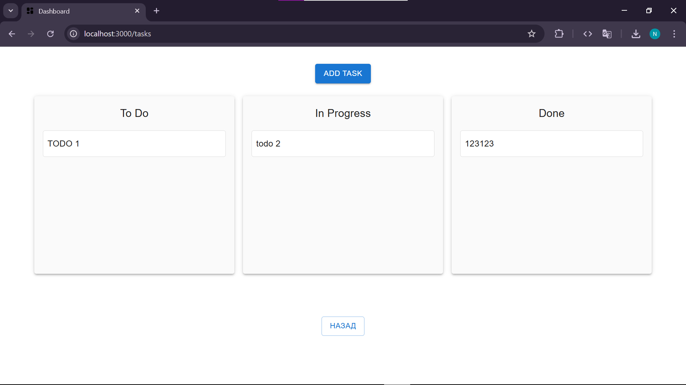

# 🚀 Supabase Kanban & Image Dashboard

A modern, full-featured React dashboard for managing tasks and images, powered by [Supabase](https://supabase.com/) and [Material UI](https://mui.com/).  
**Authentication, Kanban board, image uploads, and a beautiful, responsive UI—all in one project.**

---

## ✨ Features

- **🔐 Secure Auth:** Register, login, reset, and change password with Supabase Auth.
- **🗂️ Kanban Board:** Drag-and-drop tasks between columns ("To Do", "In Progress", "Done").
- **🖼️ Image Uploads:** Upload, preview, and manage images with Supabase Storage.
- **⚡ Fast & Responsive:** Built with Material UI for a seamless experience on any device.
- **🔒 Protected Routes:** Only authenticated users can access dashboard features.
- **💡 Clean Code:** Modular, readable, and scalable React codebase.

---

## 📦 Tech Stack

- **Frontend:** React, Material UI, Dnd Kit
- **Backend:** Supabase (Auth, Database, Storage)
- **State Management:** React Context & Hooks

---